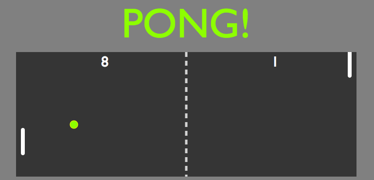

# Pong Game

A basic Javascript pong game using procedurally generated SVGs. 

## Keys

* SpaceBar: Pause
* m: Cue Music
* f: Speed up opponent paddle
* g: Return opponent to original speed

**Player:**
* ▲ : up
* ▼ : down



## Setup

**Install dependencies:**

`> npm i`

**Run locally with Webpack Dev Server:**

`> npm start`

**Build for production:**

`> npm run build`

## Build

I implemented WebPack to automatically compile .js files into the final build.js. This project was an opportunity to dive deeper into understanding javascript, and using multiple scripts to make a well organized finished product. The game includes mouse control for the player paddle, and an Ai algorithm that provides a computer opponent. You can control the speed of the opponents paddle with the 'f' and 'g' keys. There is a soundtrack included that will begin when you press the letter 'm'. 

## References 

This game was built using technology including:

CSS,
WebPack,
Visual Studio Code

```

```
The Favicon, Pong sounds, and fundimental design provided by Red Academy.

The Legend of Zelda Theme provided by: Kingdom Hearts Insider
https://downloads.khinsider.com/

Star Wars sounds provided by:
http://www.sa-matra.net/sounds/starwars/

Special Thanks to Jeremy Moseley for JavaScript advice. 

CSS reset provided by: http://meyerweb.com/eric/tools/css/reset/ 